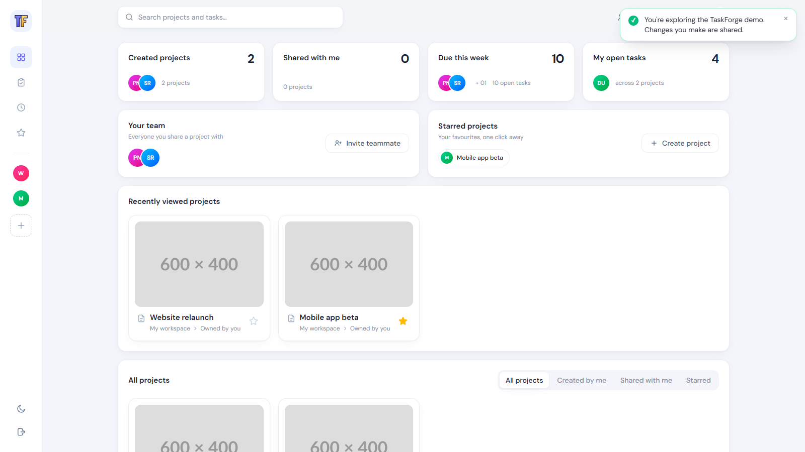

<p align="center">
  
</p>

<p align="center">
  <strong>A fast, server-rendered Kanban board for small teams, built with Django and HTMX.</strong>
</p>

<p align="center">
  <a href="#">🔗 Live demo</a> (coming soon) ·
  demo login <code>demo@taskforge.dev</code> / <code>taskforge-demo</code>
</p>

<p align="center">
  
  
  
  
  
  
  <a href="https://github.com/briankelley-it/TaskForge/actions/workflows/ci.yml"></a>
  
</p>

---

## Screenshots

| Dashboard | Kanban board | Mobile |
| --- | --- | --- |
| <!--  --> _Screenshot coming soon_ | <!--  --> _Screenshot coming soon_ | <!--  --> _Screenshot coming soon_ |

## Features

- **Accounts.** Sign up, log in and reset your password with email only (django-allauth).
- **Projects and teams.** Create projects and invite teammates by email. Owners manage settings and members.
- **Kanban board.** Drag tasks between To Do, In Progress and Done, or reorder them. Changes save instantly with no page reload.
- **Task modals.** Create, edit and view tasks in modal forms that also work with JavaScript turned off.
- **Live filters.** Search by title, filter to My tasks, Overdue or a priority, and bookmark the filtered URL.
- **Comments.** Discuss tasks inline. The board shows a comment count on each card.
- **Activity feed.** See who created, moved, assigned, commented on or deleted what.
- **Due dates.** Cards show "Due soon" and "Overdue" badges and highlights.
- **CSV export.** Download a project's tasks, with the board's current filters applied.
- **Responsive design.** Works on a phone, with a dark mode toggle that remembers your choice.
- **Permissions everywhere.** Non-members get a 404 on every project URL.

## Quick start

You need [Docker Desktop](https://www.docker.com/products/docker-desktop/).

```bash
git clone https://github.com/briankelley-it/TaskForge.git
cd TaskForge
cp .env.example .env
docker compose up
```

In a second terminal, load the demo data:

```bash
docker compose exec web python manage.py seed_demo
```

Open http://localhost:8000 and log in as `demo@taskforge.dev` / `taskforge-demo`.

While `docker compose up` is running, saving a Python file, template or stylesheet rebuilds the
CSS, restarts Django and **refreshes the browser tab automatically** (django-browser-reload).

## Running the tests

```bash
docker compose exec web pytest --cov
```

The suite has 200+ tests covering models, services, every view and HTMX endpoint,
permissions and query counts. Coverage is about 99%. CI runs ruff, the tests against Postgres 16,
and `manage.py check --deploy` on every push.

Lint and format:

```bash
ruff check . && ruff format .
```

## Architecture and decisions

```
config/     settings split into base / dev / test / prod, all read from the environment
accounts/   custom email-only User model
projects/   projects, memberships, invites, permission helpers, seed_demo
tasks/      tasks, comments, board, filters, CSV export
activity/   activity feed, written to by the task services
```

### Why HTMX instead of React

TaskForge is mostly forms, lists and a board, which is what server-rendered HTML does well.
With HTMX the server returns small HTML partials (`templates/<app>/partials/`) and HTMX swaps
them into the page, so:

- there is **one source of truth**: Django templates and views, with no duplicated API and client state
- **no build pipeline** beyond the Tailwind CLI, no Node.js and no npm
- every interaction **works without JavaScript**, falling back to full pages and redirects

Interactions that need to update more than one area use response headers. For example, saving
a task returns `204` with `HX-Trigger: {"boardChanged", "closeModal"}`, so the board reloads
itself and the modal closes. The only hand-written JavaScript is about 70 lines for the modal,
dark mode and SortableJS.

### How permissions work

All access to project data goes through one function, `projects.permissions.get_membership()`,
used by the `ProjectMemberMixin` / `ProjectOwnerMixin` class-based views and directly by the
HTMX function views. There are no access checks copy-pasted across views.

- **Not a member: 404.** A 403 would confirm that the project exists.
- **A member but not the owner, on an owner-only action: 403.**
- Tasks are always looked up **inside** the user's project, so a valid task ID can't be reached
  through a different project's URL.

The permission tests list every URL in a table and check each one for logged-out users,
non-members and non-owners.

### How the board avoids N+1 queries

The board loads every task in **one query**, using `select_related("assignee")` and
`annotate(Count("comments"))`, and groups the tasks into columns in Python. Tests use
`django_assert_num_queries` to prove the board takes the same 4 queries whether a project has 1
task or 30, with or without filters.

The dashboard's per-status task counts come from one query too. It uses
`Count(..., filter=Q(...), distinct=True)`, because joining both members and tasks would
otherwise multiply the rows and inflate the counts.

### Other decisions

- **Business logic lives in `services.py`.** Views stay thin. Moving a task, renumbering a
  column and logging activity happen in one place that is easy to test.
- **Concurrent drags are safe.** `move_task()` locks the project's tasks with
  `select_for_update()`, so two people dragging at once can't produce duplicate positions.
- **Tailwind uses the standalone CLI**, so the project needs no Node. The Docker image compiles
  the CSS in a separate build stage.
- **Production setup:** whitenoise serves hashed, compressed static files, gunicorn runs the
  app, and HTTPS and HSTS are configured. Production refuses to start with the placeholder
  `SECRET_KEY`.

## Deploying

1. Build the image from `Dockerfile`. It compiles the CSS, collects static files and runs
   gunicorn with production settings by default.
2. Set `SECRET_KEY` (50+ random characters), `DATABASE_URL`, `ALLOWED_HOSTS` and
   `CSRF_TRUSTED_ORIGINS`. `PORT` and `WEB_CONCURRENCY` are optional.
3. Run `python manage.py migrate` as a release step. Optionally run
   `python manage.py seed_demo --password <something>`.

## What I learned

### Django

### HTMX

### Testing

### Docker and deployment

### What I'd do next
