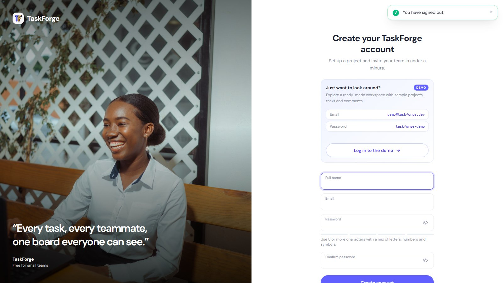

<p align="center">
  
</p>

<p align="center">
  <strong>A fast, server-rendered Kanban board for small teams, built with Django and HTMX.</strong>
</p>

<p align="center">
  <a href="#">🔗 Live demo</a> (coming soon) ·
  demo login <code>demo@taskforge.dev</code> / <code>taskforge-demo</code>
</p>

<p align="center">
  
  
  
  
  
  
  <a href="https://github.com/briankelley-it/TaskForge/actions/workflows/ci.yml"></a>
  <a href="https://github.com/briankelley-it/TaskForge/actions/workflows/ci.yml"></a>
</p>

---

## Screenshots

**Sign up, or try the one-click demo**



**Workspace dashboard**


## Features

- **Accounts.** Split-screen login and sign-up pages built on django-allauth, with:
  - email login, password reset and a "remember me" switch
  - show/hide password and a password strength meter
  - optional "Continue with Google" (set `GOOGLE_CLIENT_ID` and `GOOGLE_CLIENT_SECRET`)
- **Projects and teams.** Create projects and invite teammates by email. Owners manage settings and members.
- **Kanban board.** Drag tasks between To Do, In Progress and Done, or reorder them. Changes save instantly with no page reload.
- **Task modals.** Create, edit and view tasks in modal forms that also work with JavaScript turned off.
- **Live filters.** Search by title, filter to My tasks, Overdue or a priority, and bookmark the filtered URL.
- **Comments.** Discuss tasks inline. The board shows a comment count on each card.
- **Activity feed.** See who created, moved, assigned, commented on or deleted what.
- **Due dates.** Cards show "Due soon" and "Overdue" badges and highlights.
- **CSV export.** Download a project's tasks, with the board's current filters applied.
- **Responsive design.** Works on a phone, with a dark mode toggle that remembers your choice.
- **Workspace dashboard.** Summary cards (created, shared, due this week, my open tasks) with
  avatar stacks, your team, starred projects, and **recently viewed** projects shown as
  cards with cover images.
- **Global search.** Projects and tasks drop down as you type.
- **Notifications.** A bell with an unread count for teammates' changes in your projects.
- **Project covers.** Each card shows a placeholder until the owner uploads a cover image.
  Pick one with your computer's file picker or drag it in, with an instant preview.
  Uploads are checked with Pillow (JPG, PNG, WebP or GIF, up to 5 MB) and old files are
  cleaned up.
- **Stars and My tasks.** Star projects per person. A cross-project "My tasks" page has a
  "due this week" view.
- **Permissions everywhere.** Non-members get a 404 on every project URL.

## Quick start

You need [Docker Desktop](https://www.docker.com/products/docker-desktop/). Then it's one command:

```bash
docker compose up
```

Open http://localhost:8000 and click **Log in to the demo**, or sign in as
`demo@taskforge.dev` / `taskforge-demo`.

The first start builds the image, creates the database, runs migrations and seeds the demo
workspace (2 projects, 19 tasks). No `.env` file is needed: development defaults are built in.
To change a setting or add Google sign-in keys, copy `.env.example` to `.env` and edit it.
`docker compose exec web python manage.py seed_demo` resets the demo data at any time.

While `docker compose up` is running, saving a Python file, template or stylesheet rebuilds the
CSS, restarts Django and **refreshes the browser tab automatically** (django-browser-reload).

## Running the tests

```bash
docker compose exec web pytest --cov
```

The suite has 300 tests covering models, services, every view and HTMX endpoint,
permissions and query counts. Coverage is about 99%. CI runs ruff, the tests against Postgres 16,
and `manage.py check --deploy` on every push.

Lint and format:

```bash
ruff check . && ruff format .
```

## Architecture and decisions

> New to the code? [docs/CODE_TOUR.md](docs/CODE_TOUR.md) walks through each feature
> file by file and ends with practice interview questions.

```
config/     settings split into base / dev / test / prod, all read from the environment
accounts/   custom email-only User model
projects/   projects, memberships, invites, permission helpers, seed_demo
tasks/      tasks, comments, board, filters, CSV export
activity/   activity feed, written to by the task services
```

### Why HTMX instead of React

TaskForge is mostly forms, lists and a board, which is what server-rendered HTML does well.
With HTMX the server returns small HTML partials (`templates/<app>/partials/`) and HTMX swaps
them into the page, so:

- there is **one source of truth**: Django templates and views, with no duplicated API and client state
- **no build pipeline** beyond the Tailwind CLI, no Node.js and no npm
- every interaction **works without JavaScript**, falling back to full pages and redirects

Interactions that need to update more than one area use response headers. For example, saving
a task returns `204` with `HX-Trigger: {"boardChanged", "closeModal"}`, so the board reloads
itself and the modal closes. The only hand-written JavaScript is about 200 lines (`static/js/app.js`) for things HTMX
can't do alone: the modal, dark mode, drag and drop, toasts and the auth-page helpers.

### How permissions work

All access to project data goes through one function, `projects.permissions.get_membership()`,
used by the `ProjectMemberMixin` / `ProjectOwnerMixin` class-based views and directly by the
HTMX function views. There are no access checks copy-pasted across views.

- **Not a member: 404.** A 403 would confirm that the project exists.
- **A member but not the owner, on an owner-only action: 403.**
- Tasks are always looked up **inside** the user's project, so a valid task ID can't be reached
  through a different project's URL.

The permission tests list every URL in a table and check each one for logged-out users,
non-members and non-owners.

### How the board avoids N+1 queries

The board loads every task in **one query**, using `select_related("assignee")` and
`annotate(Count("comments"))`, and groups the tasks into columns in Python. Tests use
`django_assert_num_queries` to prove the page's query count stays fixed (7, including the
sidebar and the header's member avatars) whether a project has 1 task or 30. The filtered board
partial takes 4, and the dashboard takes 8 however many projects you have.

The notifications badge loads with `hx-trigger="load"` after the page, so the bell never adds
a query to, or slows down, the page itself.

The dashboard's per-status task counts come from one query too. It uses
`Count(..., filter=Q(...), distinct=True)`, because joining both members and tasks would
otherwise multiply the rows and inflate the counts.

### Other decisions

- **Business logic lives in `services.py`.** Views stay thin. Moving a task, renumbering a
  column and logging activity happen in one place that is easy to test.
- **Concurrent drags are safe.** `move_task()` locks the project's tasks with
  `select_for_update()`, so two people dragging at once can't produce duplicate positions.
- **Tailwind uses the standalone CLI**, so the project needs no Node. The Docker image compiles
  the CSS in a separate build stage.
- **Production setup:** whitenoise serves hashed, compressed static files, gunicorn runs the
  app, and HTTPS and HSTS are configured. Production refuses to start with the placeholder
  `SECRET_KEY`.

## Deploying

1. Build the image from `Dockerfile`. It compiles the CSS, collects static files and runs
   gunicorn with production settings by default.
2. Set `SECRET_KEY` (50+ random characters), `DATABASE_URL`, `ALLOWED_HOSTS` and
   `CSRF_TRUSTED_ORIGINS`. `PORT` and `WEB_CONCURRENCY` are optional.
3. Uploaded cover images go to `MEDIA_ROOT` (default `media/`). Whitenoise only serves
   static files, so mount a persistent volume there and have your web server serve
   `/media/`, or switch the `default` storage to S3-style object storage.
4. Run `python manage.py migrate` as a release step. Optionally run
   `python manage.py seed_demo --password <something>`.
